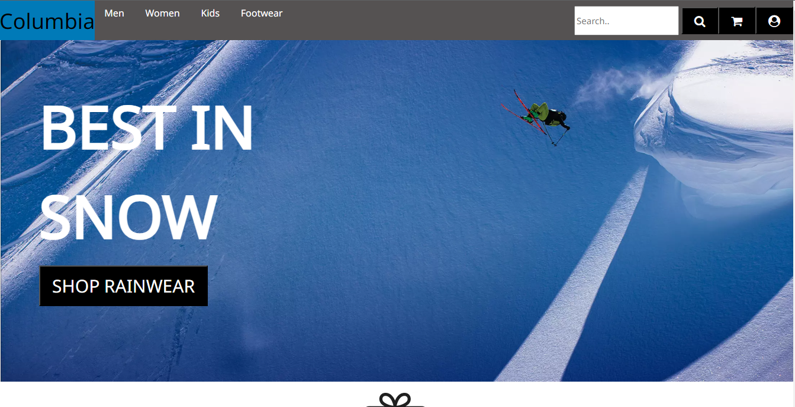
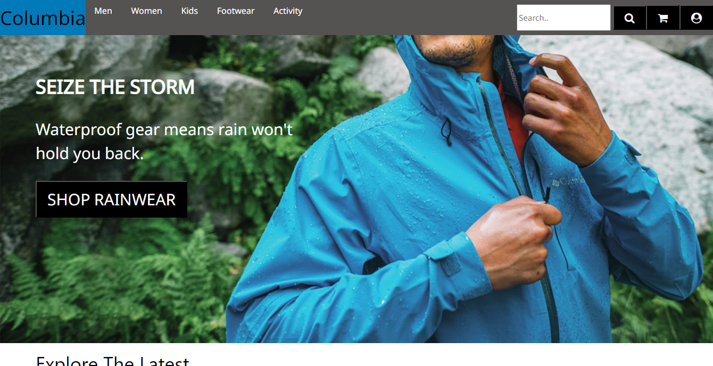
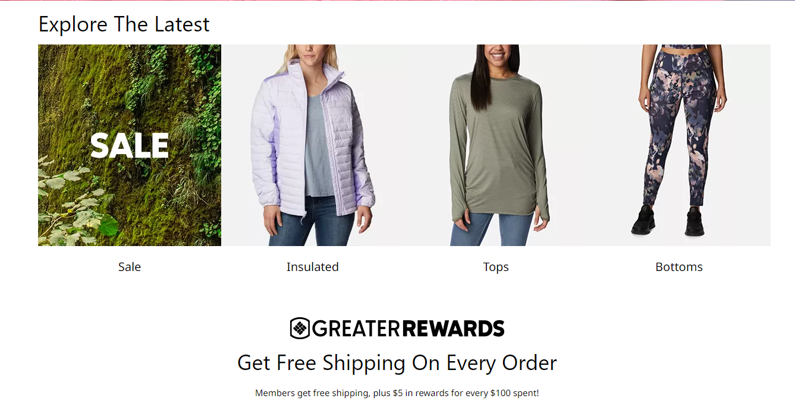
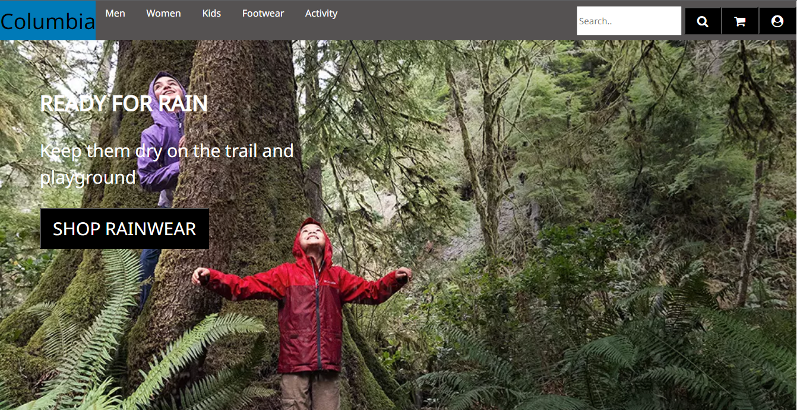

# SilkShop

This e-commerce website is clone of Columbia.com and sells wearables like pants, jackets, caps, etc. Also I have added multiple CRUD operations and functions like searching,sorting, filtering etc. Its a collaborative project. This project was assigned to :

### Developer

* Baibhav Kumar

In this project I have tried to design and build as much as possible in the given constraint of time. With our efforts and skills ,that I have learned in the MASAI school , I have accomplished the task.

## Tech Stacks Used

1. Vanilla Javascript
2. HTML
3. CSS

## Features

1. Login/Register
2. Searching
3. Sorting
4. Filtering

# HOME PAGE

# MEN CATEGORY PAGE

# WOMEN CATEGORY PAGE

# KIDS CATEGORY PAGE

## Deployed Link

https://dulcet-buttercream-10e812.netlify.app

### Limitations

Pages are not responsive.